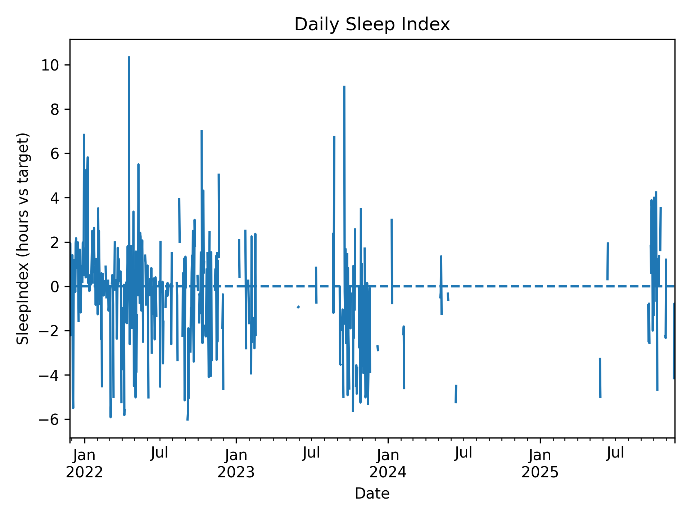
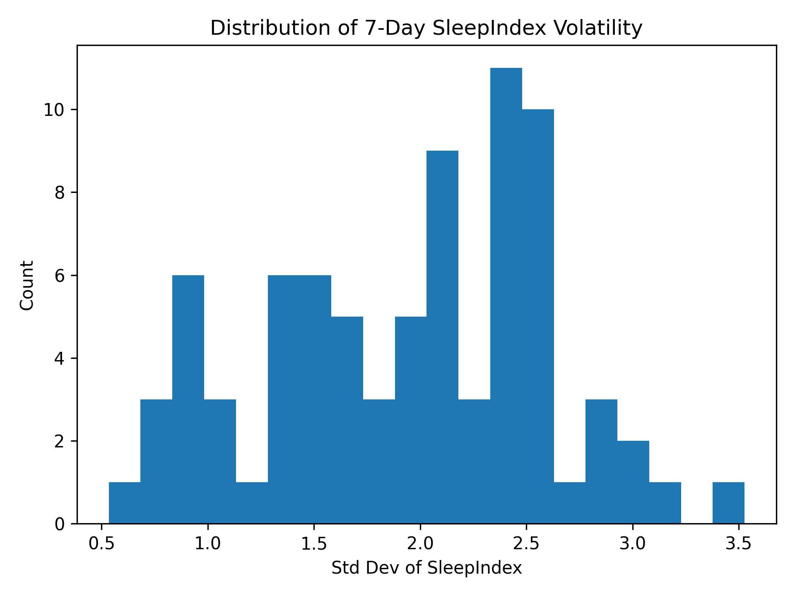
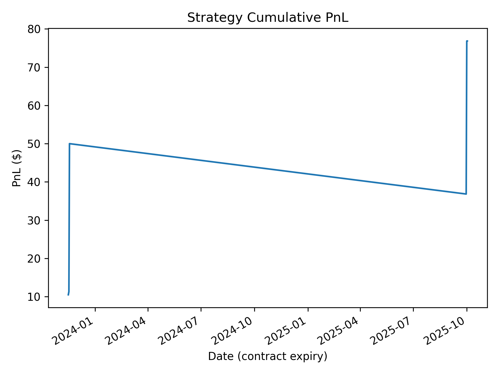

# Sleep Futures Quant Research Project

**Built with Python, CatBoost, Time-Series Engineering & Streamlit**

This project transforms my daily sleep behavior into a **tradable synthetic futures market**, using a full quant workflow:

- Data engineering
- Feature modeling
- Classification forecasting
- Trading strategy construction
- Backtesting with PnL, Sharpe, and drawdowns
- Visualization dashboard

This makes it a unique **behavioral-finance + time-series modeling project with real forecasting, alpha signals, and a fully implemented trading simulation.**

# Project Summary

- Sleep Index
- directional classifier (predict ↑ / ↓ sleep tomorrow)
- synthetic futures contract with payoff linked to next-day SleepIndex
- trading strategy using model-predicted positions
- backtest with full quant metrics
- Streamlit dashboard for visualization

# Example Model Performance

**Classification Metrics**

- Overall Accuracy: 66.67%
- Directional Accuracy (ignoring neutral): 66.67%

**Backtest Results (Direction Strategy)**

- Total PnL: $76.83
- Sharpe Ratio: 9.287
- Max Drawdown: –$13.17

# Core Concept

## Sleep Index Definition:
$$
\mathrm{SleepIndex}_t = \mathrm{hours\_slept}_t - 7.5
$$

`A positive index = slept more than target.`
`A negative index = slept less.`

## Synthetic Futures Contract:
$$
\text{Payoff}_t+1​ = CONTRACT_MULTIPLIER × \text{SleepIndex}_t+1
$$

The model forecasts whether tomorrow’s Sleep Index will be:

 - **Up → Go long**
- **Down → Go short**
- **Neutral → Stay flat**

**PnL is determined by how well the model predicts tomorrow’s direction.**


# Visualizations & Interpretation

## 1. Daily Sleep Index

**Shows how many hours above/below target slept each day.**



**Interpretation:**

- Positive spikes = great sleep (+3 to +10 hours)
- Negative spikes = undersleeping
- The dashed zero line is “target sleep" reference
- Variance shows how inconsistent or steady sleep habits are
- This serves as the underlying time series for modeling.

## 2. Sleep Volatility Histogram

**Shows the 7-day rolling standard deviation of SleepIndex.**



**Interpretation:**

- Most 7-day volatility is between 1.0 and 2.5
- High volatility means irregular sleep patterns
- Helps explain why forecasting sleep is harder during chaotic periods


## 3. Strategy PnL Curve

**Displays cumulative profit of the long/short strategy.**



**Interpretation:**

- The model produced positive cumulative PnL
- Sharpe ratio > 9 indicates very high signal-to-noise
- Max drawdown shows the worst peak-to-bottom decline
- This demonstrates alpha generation from behavioral patterns

# Features

**Engineering:**

- 3-day, 7-day, 14-day rolling means
- Sleep deficit
- Circadian drift (bedtime deviation)
- Sleep efficiency
- Day-of-week indicators
- Weekend/weekday flag
- Next-day classification target (↑, ↓, →)

**Modeling:**

- CatBoostClassifier (best for nonlinear tabular time series)
- Chronological train/test split
- Early stopping
- Multi-class classification using direction labels

# Trading Strategy Logic

```bash
If model predicts ↑ → take LONG position
If model predicts ↓ → take SHORT position
If model predicts → → stay FLAT
PnL = SleepIndex(t+1) * contract_multiplier
```

**Backtest includes:**

- Cumulative PnL
- Daily returns
- Sharpe ratio
- Max drawdown


# Why This Project Matters

This pipeline demonstrates real quant concepts:

- Signal generation: SleepIndex dynamics
- Feature engineering: rolling windows, drift, volatility
- Classification modeling: direction forecasting
- Derivatives pricing: custom payoff functions
- Backtesting: Sharpe, drawdowns, PnL

**Visualization: monitoring signals & risk**

# Technology Stack
```bash
- Python
- pandas
- numpy
- matplotlib
- catboost
- scikit-learn
- statsmodels
- Visualization
- Matplotlib
- Streamlit
- Modeling
- CatBoostClassifier
- Rolling features
- Classification targets
- Volatility estimation
- Backtesting
- Custom long/short engine
- PnL simulation
- Drawdown tracking
- Sharpe ratio calculation
```

# Project Architecture

```bash
.
├── data/
│   ├── raw/                      # Input sleep CSV
├── src/
│   ├── data_loader.py            # Load + clean raw sleep data
│   ├── features.py               # Feature engineering
│   ├── model.py                  # CatBoost classification model
│   ├── backtest.py               # Synthetic futures backtesting
│   ├── visualize.py              # Matplotlib visualizations
│   └── run_pipeline.py           # Full pipeline runner
├── app.py                        # Streamlit dashboard
├── charts/                       # Saved PNG plots
├── requirements.txt
└── README.md
```

# Installation & Usage

```bash
1. Clone the repository
git clone https://github.com/YOUR-USERNAME/sleep-futures.git
cd sleep-futures-qm

2. Create virtual env
python3 -m venv .venv
source .venv/bin/activate

3. Install dependencies
pip install -r requirements.txt

4. Add sleep.csv

data/raw/sleep.csv

5. Run the full pipeline
python3 -m src.run_pipeline

6. Run the Streamlit dashboard

streamlit run app.py
```